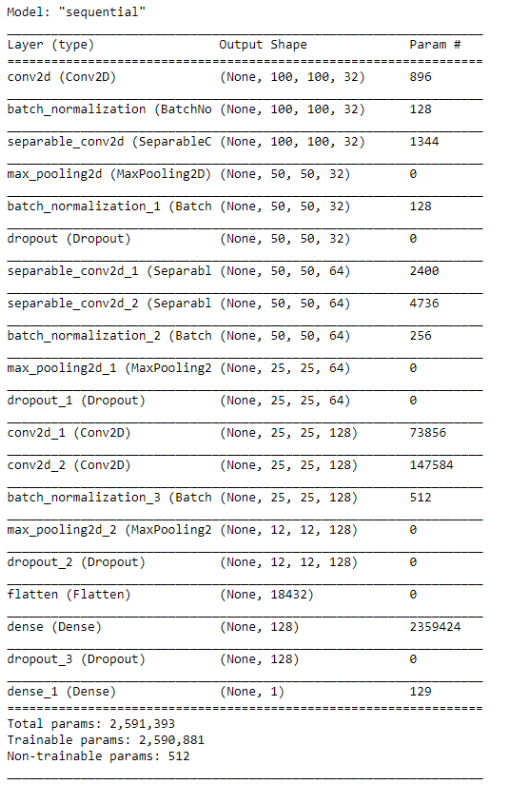
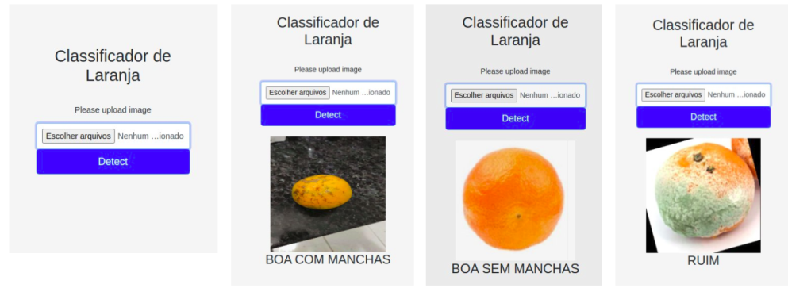

# Classificador de Laranjas 
### Deep Learning - 2020/1

## Integrantes

| Nome               | Matrícula  | GitHub             |
|--------------------|------------|--------------------|
| Ícaro Oliveira     | 15/0129807 | @icarooliv         |
| Guilherme Siqueira | 16/0007763 | @guilhermesiqueira |
| Pedro Henrique Oliveira | 17/0153975 | @pedroholiveira1998|
| Augusto Vilarins   |            | @augustovilarins   |

## O Projeto

O classificador trata-se de um projeto desenvolvido coletivamente, para a disciplina de Tópicos especiais de engenharia de software - Deep Learning.

O projeto foi idealizado como uma alternativa a seleção manual de frutas para agricultores de todos os portes, automatizando o processo por meio de Deep Learning  para realizar tal feito. Afunilamos o escopo para o de laranjas, de forma a simplificar o escopo e viabilizar o projeto no prazo estipulado. Por se tratar da fruta mais consumida no mundo e principalmente, no Brasil, escolhemos a laranja como nosso objeto de estudo.

## Desenvolvimento

Foi utilizada a estrategia de Redes Neurais Convolucionais utilizando o Keras.

Após feito o tratamento das imagens e com os componentes já importados. Foi
utilizado o modelo Sequential() do Keras, sendo este um modelo que se sobressai quando
se trata de uma pilha de camadas simples, tendo cada camada exatamente um tensor
de entrada e outro de saída. Neste modelo adicionamos um total de 20 camadas, estas
camadas abrangendo diversas utilidades dentro do treinamento.

### Camadas

A primeira camada foi uma camada de convolução, onde, essa realiza a extração
dos recursos da imagem de entrada e cria 32 recursos convolutos 3x3 ReLu ou, também
conhecido como mapa de recursos, posteriormente adicionamos outras duas dessa mesma
camada. A rede neural possui também em sua composição: 

* 3 camadas de normalização; 
* 3 camadas de pooling, que criam uma subamostragem do mapa de recursos;
* 3 camadas de convolução separáveis 2d; 
* 3 camadas de dropout;
* 2 de densidade e;
* 1 de achatamento

## Tecnologias
## Requisitos para execução do código

* MongoDB

É necessário ter as seguintes bibliotecas instaladas para a execução do projeto, além do Python 3.7+:

* Flask==1.1.2
* torch==1.5.1+cpu
* opencv-python==4.3.0.36
* numpy==1.16.0
* Keras
* pymongo==3.11.1

## Dataset
O dataset está disponível [neste link](https://www.kaggle.com/jppgomes/dataset-laranjas).

## App

A API desenvolvida é responsável por dar uma interface ao mecanismo de classificação.

Internamente, a aplicação faz a coleta dos dados com base nas imagens fornecidas
e o resultado destas classificações. Ao receber as imagens dos frutos os seguintes dados
são salvos no banco de dados MongoDB: as próprias imagens, a classificação feita pelo
algoritmo, a remessa e a data do processamento. 

## Sugestões de trabalhos futuros a partir desse

* Utilizar o algoritmo embarcado em uma camera para classificar as laranjas em uma esteira de seleção
* Os dados coletados podem servir de treino para melhorar o algoritmo;
* Uma dashboard para visualizar dados da coleta
